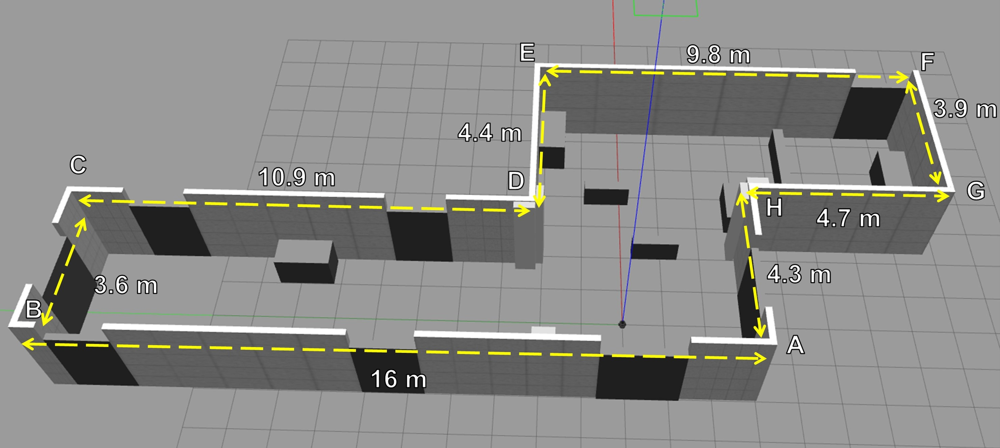
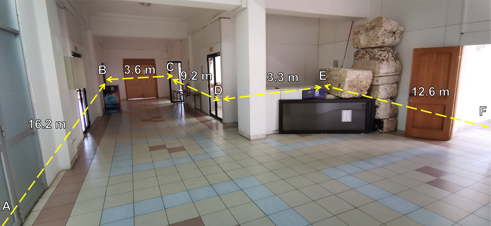
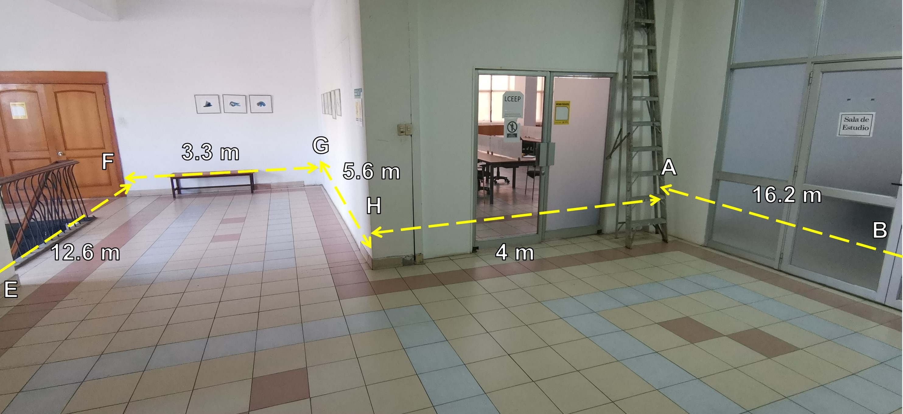

# Escenario de Simulación en Gazebo

Paquete ROS con un entorno de simulación creado en Gazebo basado en una parte del centro de extensión de la Universidad de Talca.

# Requisitos

* ROS
* Gazebo 11
* Catkin Tools


# Vista previa

* Escenario de simulación en Gazebo (con obstáculos):




>[!NOTE]
> El paquete incluye una versión del escenario sin obstáculos llamado `pasillo_cextension.world` y una versión con obstáculos `pasillo_cextension_obstaculos.xml`. Ambos se ubican en `worlds`.

* Entorno real de referencia:






# Utilización

1. Compilar el paquete con Catkin Tools:

```
catkin build gazebo_world_turtlebot3
```

2. Ejecutar el mundo en Gazebo con ROS:

```
roslaunch gazebo_world_turtlebot3 turtlebot3_simulation.launch
```


